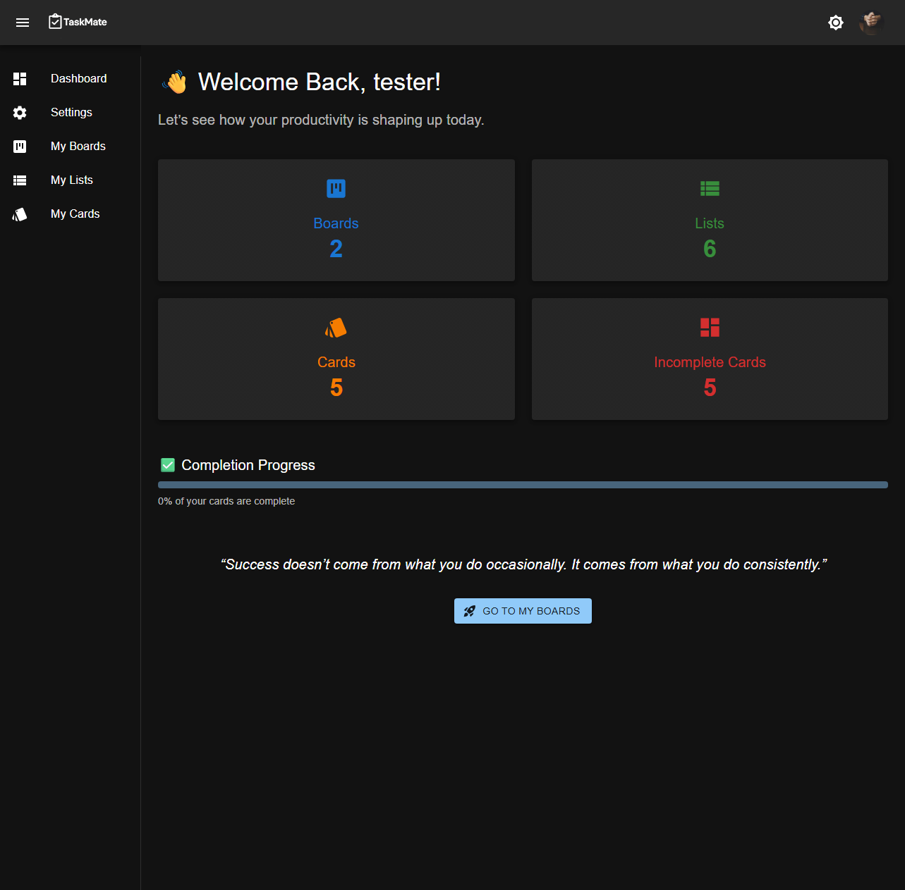
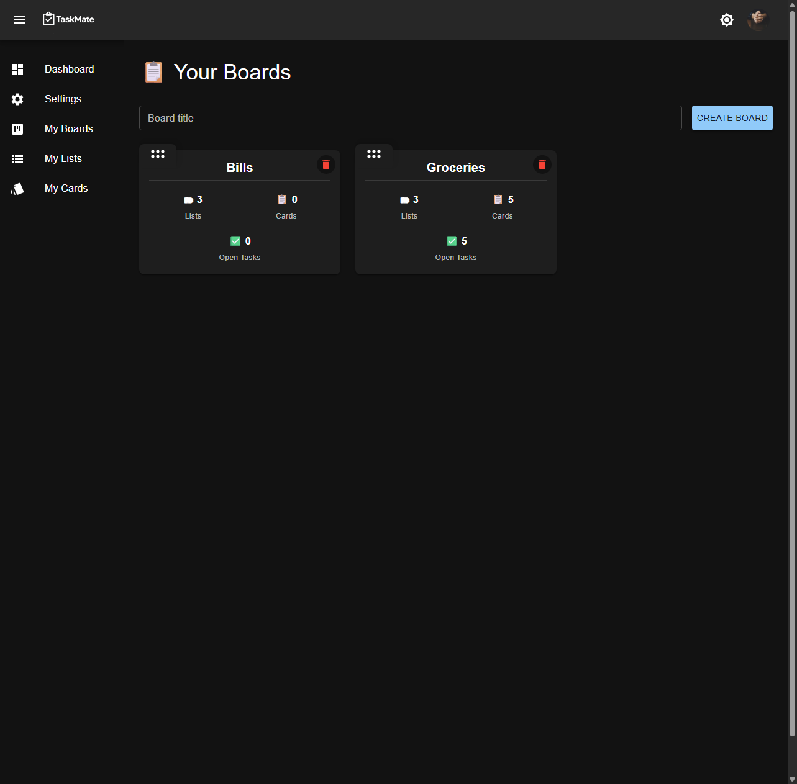
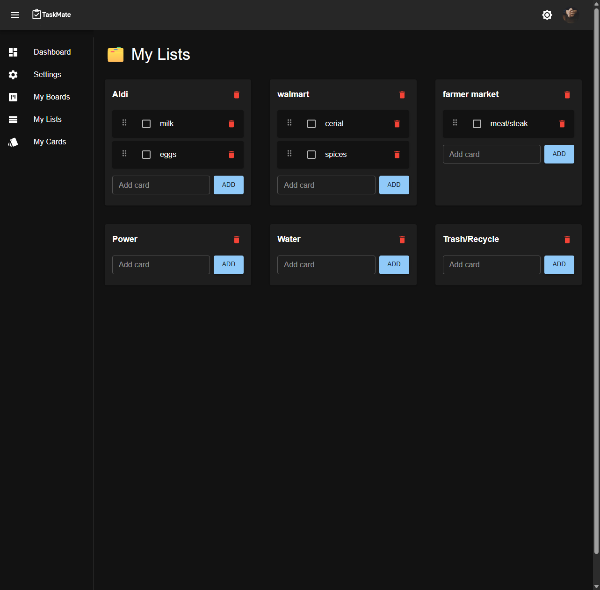
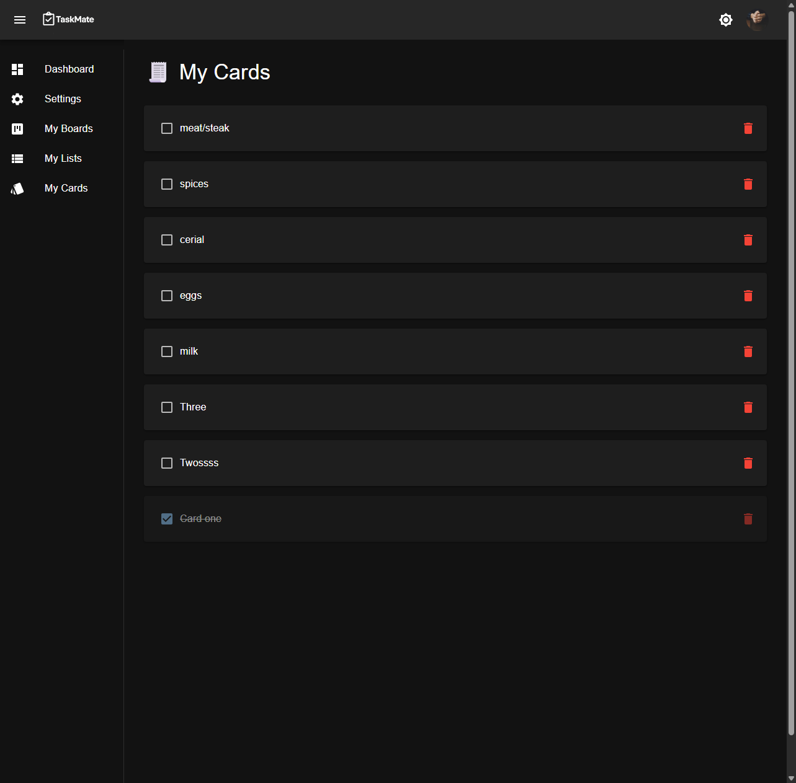

# ✅ TaskMate – Full Stack Task Management App

TaskMate is a full-stack task management application built to make organizing work simple, fast, and interactive. Users can create and manage boards, lists, and cards directly from the interface, with changes reflected immediately throughout the app.

The project was built to practice and demonstrate real-world full-stack development patterns including relational database design, REST APIs, reusable React components, responsive UI design, and interactive drag-and-drop functionality.

---

## 🔥 Features

* 📋 Create and manage multiple boards
* 🧱 Organize boards into customizable lists
* 📝 Create and manage individual task cards
* 🖱️ Drag-and-drop functionality for reorganizing boards
* ⚡ Reactive UI with immediate updates
* ➕ Add items directly from the screen
* ✏️ Edit existing boards, lists, and cards without leaving the current workflow
* 🗑️ Remove boards, lists, and cards directly from the interface
* 🔄 Changes are reflected throughout the application without unnecessary page reloads
* 📱 Responsive interface designed for desktop and smaller screens
* 🔌 RESTful API architecture
* 💾 PostgreSQL database with Prisma ORM
* 🐳 Dockerized development environment

---

## 📸 Screenshots

### Dashboard



### My Boards



### My Lists



### My Cards



---

## 🧱 Tech Stack

| Layer           | Technology              |
| --------------- | ----------------------- |
| Frontend        | React + Vite            |
| Backend         | Node.js + Express       |
| Database        | PostgreSQL              |
| ORM             | Prisma                  |
| API             | REST                    |
| Development     | Docker + Docker Compose |
| Version Control | Git + GitHub            |

---

## 🏗️ Application Structure

TaskMate uses a client/server architecture with a React frontend communicating with an Express API.

```text
React + Vite Client
        │
        │ REST API
        ▼
Node.js + Express Server
        │
        ▼
     Prisma ORM
        │
        ▼
 PostgreSQL Database
```

Boards, lists, and cards are stored relationally in PostgreSQL and managed through Prisma. The frontend communicates with the API to keep the interface and database synchronized as users make changes.

---

## ⚡ Interactive Task Management

A major focus of TaskMate is keeping task management fast and intuitive.

Instead of forcing users through separate forms or pages for every action, the application allows boards, lists, and cards to be managed directly from the interface.

Users can:

* Create new items
* Update existing information
* Remove items
* Reorganize content
* Move through boards, lists, and cards
* See changes reflected immediately

This creates a more responsive experience and keeps users focused on their work instead of managing the application itself.

---

## 🖱️ Drag-and-Drop Boards

TaskMate includes drag-and-drop functionality that allows boards to be reorganized visually from the interface.

The goal was to make organization feel natural and interactive rather than relying entirely on traditional forms and navigation.

Changes made through drag-and-drop are reflected in the application so the updated board organization remains consistent with the stored data.

---

## 💾 Data Model

TaskMate is structured around three primary task-management concepts:

```text
Board
  │
  └── Lists
        │
        └── Cards
```

This relational structure allows boards to contain multiple lists while each list can contain multiple cards.

Using Prisma with PostgreSQL provides a clear and maintainable way to manage these relationships while keeping the API logic organized.

---

## 🐳 Docker Development

TaskMate is designed to run in a Dockerized development environment.

The project separates the frontend, backend, and PostgreSQL database while allowing them to communicate through Docker Compose.

Typical structure:

```text
/client     → React + Vite frontend
/server     → Node.js + Express API
/db         → PostgreSQL database
```

Start the project with:

```bash
docker compose up --build
```

Docker keeps the development environment consistent and avoids requiring dependencies to be installed globally on the host machine.

---

## 🧪 Local Development

### 1. Clone the repository

```bash
git clone https://github.com/yourusername/taskmate.git
cd taskmate
```

### 2. Configure environment variables

Create your local environment files using the included `.env.example` files as a reference.

Real `.env` files are intentionally excluded from Git and should never contain credentials that are committed to the repository.

Example client configuration:

```env
VITE_API_BASE_URL=http://localhost:3000/api
```

Example server configuration:

```env
DATABASE_URL=postgresql://postgres:your_password@db:5432/taskmate
CLIENT_ORIGIN=http://localhost:5173
```

Update these values to match your local Docker configuration.

### 3. Start the application

```bash
docker compose up --build
```

Typical local URLs:

```text
Frontend:    http://localhost:5173
Backend API: http://localhost:3000/api
```

---

## 🔐 Environment Security

Real environment files are excluded from source control.

```text
client/.env
server/.env
```

Only safe example files should be committed:

```text
client/.env.example
server/.env.example
```

This keeps application configuration documented without exposing passwords, secrets, or production credentials.

---

## 💡 Engineering Decisions

TaskMate was built around several decisions intended to make the application easier to maintain and use:

* Relational Board → List → Card database structure
* RESTful API communication between frontend and backend
* Prisma ORM for PostgreSQL database access
* Reusable React components
* Interactive UI actions instead of unnecessary page navigation
* Immediate interface updates when data changes
* Drag-and-drop organization
* Separation of frontend, backend, and database concerns
* Dockerized local development
* Responsive layouts for different screen sizes

These decisions helped turn TaskMate from a basic CRUD application into a more interactive task-management experience.

---

## 🎯 Project Goal

TaskMate was built as a portfolio project to strengthen my understanding of how frontend interaction, API design, relational databases, and backend logic work together inside a complete application.

One of the biggest focuses of the project was moving beyond basic create/read/update/delete forms and building an interface where users can manipulate their data naturally and immediately from the screen.

The result is a responsive full-stack application that demonstrates both backend development and interactive frontend engineering.

---

## 🙋 About the Developer

TaskMate was built by **Caleb Hoffman** as part of a growing collection of production-style full-stack JavaScript projects.

My focus is on building practical applications using modern technologies and industry-standard development patterns, with an emphasis on clean architecture, maintainable code, responsive interfaces, and real-world usability.

### Core Technologies

**React • Vite • Node.js • Express • PostgreSQL • Prisma • Docker • REST APIs**

---

## 📄 License

MIT License

Free to use, modify, and build upon.
